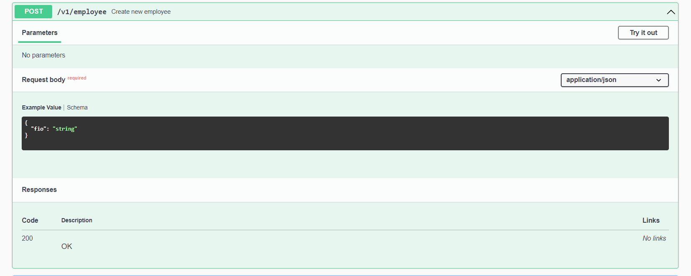
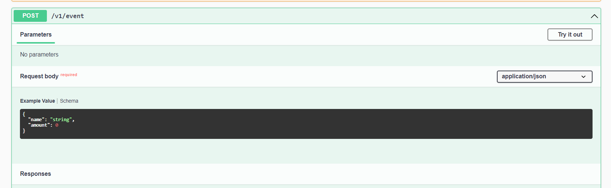
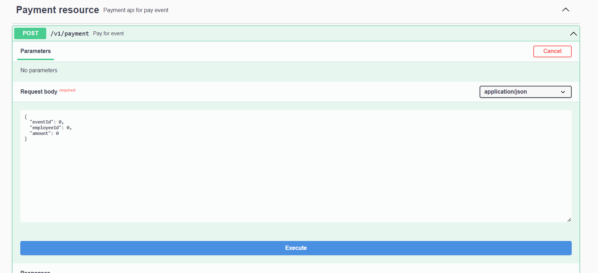
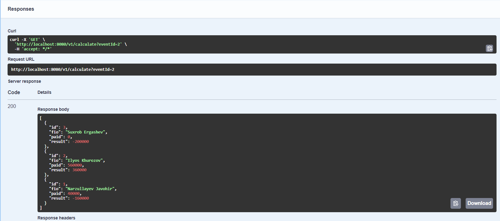

## Getting Started
Purpose of project calculate all fee of employees

### Prerequisites

To start of project need to install [docker](https://docs.docker.com/engine/install/)
* Docker start
  ```shell
  docker-compose up --build
* Docker container recreate
  ```shell
  docker-compose up --force-recreate --build -d

## Usage
After successfully start docker containers you may see project is running.
To see all resource enter to [swagger](http://localhost:8081/v1/swagger/swagger-ui/index.html#/)

* Add participant

* Add event with amount

* Payment for event

* Calculate
